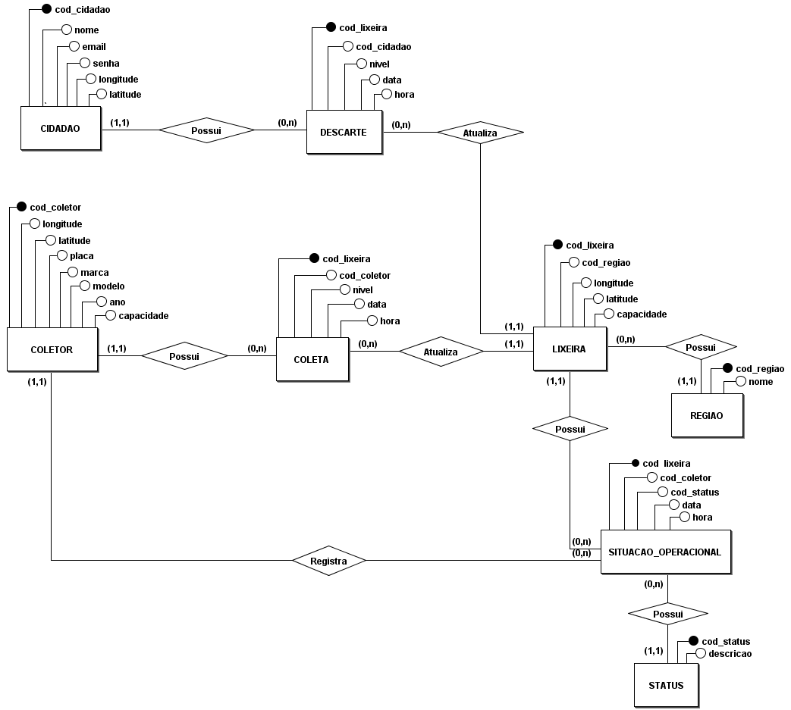

# TRABALHO 01:  Lixeira Inteligente
Trabalho desenvolvido durante a disciplina de BD1

# Sumário

### 1. COMPONENTES 
Integrantes do grupo 
Jackson William: jacksonwilliansilvaagostinho@gmail.com 
Lavinia Corteletti: laviniacort@gmail.com 
Thiago Moreira: thiago.moreira.ribeiro@gmail.com 
Vinicius Freitas: viniciusrocha28@gmail.com 

#
### 2.INTRODUÇÃO E MOTIVAÇAO 

O sistema Lixeira Inteligente tem como objetivo auxiliar na coleta e no descarte de lixo. A aplicação auxiliará os cidadãos a encontrar a lixeira mais próxima disponível para o descarte e os coletores a percorrer o melhor trajeto  para o recolhimento de  resíduos das lixeiras consideradas como cheias.  Esse sistema tenta minimizar o problema de descarte de lixo de modo inapropriado, evitando que a cidade fique suja, e também visa criar rotas otimizadas para os coletores a fim de diminuir o desperdício de recursos durante o processo. 
 
 
#
### 3.MINI-MUNDO 

O sistema Lixeira Inteligente precisa armazenar as seguintes informações. Sobre o bairro é preciso armazenar o código do bairro e nome do bairro. Sobre a lixeira é necessário armazenar o código da lixeira, código do bairro, localização (longitude e latitude), volume máximo, volume atual de lixo, data/hora da atualização do volume. A lixeira tem Status de Situação Operacional, composto pelo código da lixeira, código do coletor, status, descrição e data/hora. Sobre o cidadão será armazenado o código do cidadão, nome, email, senha e a sua localização (longitude e latitude). Para o coletor é preciso armazenar o código do coletor,  localização atual (longitude e latitude), placa, marca, modelo, ano, volume máximo. A versão do aplicativo voltado para o cidadão necessita do cadastro do mesmo  para permitir visualizar  as lixeiras mais próximas de sua localização com o menor volume de lixo contido.  A versão do aplicativo voltado para os coletores apresentará o melhor caminho para realizar a coleta no bairro selecionado, além de permitir que ele atualize o status operacional da lixeira. A rota será criada com base na prioridade de coleta, ou seja, a necessidade de recolher os lixos nas lixeiras das quais atingirem o volume de resíduo maior ou igual a 70% do seu volume máximo.  Somente um administrador poderá alterar as rotas. 

#
### 4.RASCUNHOS BÁSICOS DA INTERFACE (MOCKUPS) 

[Protótipo Lixeira Inteligente](https://github.com/jalathivi/trab01/blob/master/arquivos/lixeira_inteligente_telas.pdf) 

#### 4.1 QUAIS PERGUNTAS PODEM SER RESPONDIDAS COM O SISTEMA PROPOSTO?

- Relatório do volume atual das lixeiras que informe:ID da lixeira, data e hora  da última atualização, seu volume anterior e o atual;
- Relatório das lixeiras próximas disponíveis para descarte que informe: coordenadas e ID’s das lixeiras próximas;  
- Relatório das lixeiras que atingiram nível igual ou superior a 70% da capacidade máxima que informe: código e nível de preenchimento das lixeiras;
- Relatório da rota otimizada para o motorista que informe a rota e o seu tempo médio estimado;
- Relatório da situação operante das lixeiras que informe: status de operação (operante ou inoperante) e descrição de situação

 
 
#### 4.2 TABELA DE DADOS DO SISTEMA:

[Tabela de Dados do Lixeira Inteligente](https://github.com/jalathivi/trab01/blob/master/arquivos/lixeira_inteligente_tabela.xlsx) 
[Tabela de Dados Normalizada do Lixeira Inteligente](https://github.com/jalathivi/trab01/blob/master/arquivos/lixeira_inteligente_tabela_normalizada.xlsx) 

#
### 5.MODELO CONCEITUAL 

#### 5.1 Validação do Modelo Conceitual
<b>[Lista de Compras Online]</b>: [Matheus Garcias, Letícia Teixeira, Júlia Miranda, Henrique Bastos] 
<b>[Tratamento Efetivo]</b>: [Ana Carolina, Pedro Henrique, Emanuel Medeiros, Filipe Ribeiro]

#### 5.2 DECISÕES DE PROJETO

<b>email </b> : Determinamos o atributo como simples, pois apenas um único e-mail será necessário;

<b>longitude / latitude</b> : Optamos por manter os atributos que corresponde as coordenadas de latitude e longitude separados para facilitar a manipulação do mesmo;

<b> data / hora </b> : Optamos por manter os atributos que correspondem a data e a hora de modos separados para ter um controle mais preciso das informações e seus registros, visando também futuras buscas e relatórios a serem gerados;

>## Marco de Entrega 02 em: (30/04/2019) 
#### 5.3 DESCRIÇÃO DOS DADOS 
    [objeto]: [descrição do objeto]
    
    EXEMPLO:
    CLIENTE: Tabela que armazena as informações relativas ao cliente 
    CPF: campo que armazena o número de Cadastro de Pessoa Física para cada cliente da empresa. 

#
### 6	MODELO LÓGICO 
        a) inclusão do modelo lógico do banco de dados
        b) verificação de correspondencia com o modelo conceitual 
        (não serão aceitos modelos que não estejam em conformidade)

#
### 7	MODELO FÍSICO 
        a) inclusão das instruções de criacão das estruturas DDL 
        (criação de tabelas, alterações, etc..)          

#        
### 8	INSERT APLICADO NAS TABELAS DO BANCO DE DADOS 
#### 8.1 DETALHAMENTO DAS INFORMAÇÕES
        a) inclusão das instruções de inserção dos dados nas tabelas criadas pelo script de modelo físico 
        b) formato .SQL

#### 8.2 INCLUSÃO DO SCRIPT PARA CRIAÇÃO DE TABELAS E INSERÇÃO DOS DADOS
        a) Junção dos scripts anteriores em um único script 
        (create para tabelas e estruturas de dados + dados a serem inseridos)
        b) Criar um novo banco de dados para testar a restauracao 
        (em caso de falha na restauração o grupo não pontuará neste quesito)
        c) formato .SQL
#### 8.3 INCLUSÃO DO SCRIPT PARA EXCLUSÃO DE TABELAS EXISTENTES, CRIAÇÃO DE TABELA NOVAS E INSERÇÃO DOS DADOS
        a) Junção dos scripts anteriores em um único script
        (Drop para exclusão de tabelas + create para tabelas e estruturas de dados + dados a serem inseridos)
        b) Criar um novo banco de dados para testar a restauracao 
        (em caso de falha na restauração o grupo não pontuará neste quesito)
        c) formato .SQL
#### 8.4 Principais fluxos de informação e principais tabelas do sistema
        a) Quais os principais fluxos de dados de informação no sistema em densenvolvimento (mínimo 3)
        b) Quais as tabelas que conterão mais dados no sistema em densenvolvimento (mínimo 3)
        c) informe quais as 5 principais tabelas do sistema em densenvolvimento.
>## Marco de Entrega 03 em: (13/05/19)  

#
### 9	TABELAS E PRINCIPAIS CONSULTAS 
    OBS: Incluir para cada tópico as instruções SQL + imagens (print da tela) mostrando os resultados. 
#### 9.1	CONSULTAS DAS TABELAS COM TODOS OS DADOS INSERIDOS (Todas)  
#### 9.2	CONSULTAS DAS TABELAS COM FILTROS WHERE (Mínimo 4) 
#### 9.3	CONSULTAS QUE USAM OPERADORES LÓGICOS, ARITMÉTICOS E TABELAS OU CAMPOS RENOMEADOS (Mínimo 11)
    a) Criar 5 consultas que envolvam os operadores lógicos AND, OR e Not
    b) Criar no mínimo 3 consultas com operadores aritméticos 
    c) Criar no mínimo 3 consultas com operação de renomear nomes de campos ou tabelas
#### 9.4	CONSULTAS QUE USAM OPERADORES LIKE E DATAS (Mínimo 12)  
    a) Criar outras 5 consultas que envolvam like ou ilike
    b) Criar uma consulta para cada tipo de função data apresentada.

#### 9.5	ATUALIZAÇÃO E EXCLUSÃO DE DADOS (Mínimo 6) 

#### 9.6	CONSULTAS COM JUNÇÃO E ORDENAÇÃO (Mínimo 6) 
        a) Uma junção que envolva todas as tabelas possuindo no mínimo 3 registros no resultado
        b) Outras junções que o grupo considere como sendo as de principal importância para o trabalho
#### 9.7	CONSULTAS COM GROUP BY E FUNÇÕES DE AGRUPAMENTO (Mínimo 6) 
#### 9.8	CONSULTAS COM LEFT E RIGHT JOIN (Mínimo 4) 
#### 9.9	CONSULTAS COM SELF JOIN E VIEW (Mínimo 6) 
        a) Uma junção que envolva Self Join
        b) Outras junções com views que o grupo considere como sendo de relevante importância para o trabalho
#### 9.10	SUBCONSULTAS (Mínimo 3) 

>## Marco de Entrega 03 em: (27/05/2019) 

#### 9.11 Relatórios e Gráficos 
    a)análises e resultados provenientes do banco de dados

#
### 10	ATUALIZAÇÃO DA DOCUMENTAÇÃO DOS SLIDES PARA APRESENTAÇAO FINAL (Mínimo 6 e Máximo 10) 

#
### 11 Backup completo do banco de dados postgres 
    a) deve ser realizado no formato "backup" 
        (Em Dump Options #1 Habilitar opções Don't Save Owner e Privilege)
    b) antes de postar o arquivo no git o mesmo deve ser testado/restaurado por outro grupo de alunos/dupla
    c) informar aqui o grupo de alunos/dupla que realizou o teste.

#
### 12	TUTORIAL COMPLETO DE PASSOS PARA RESTAURACAO DO BANCO E EXECUCAO DE PROCEDIMENTOS ENVOLVIDOS NO TRABALHO PARA OBTENÇÃO DOS RESULTADOS 
        a) Outros grupos deverão ser capazes de restaurar o banco 
        b) executar todas as consultas presentes no trabalho
        c) executar códigos que tenham sido construídos para o trabalho 
        d) realizar qualquer procedimento executado pelo grupo que desenvolveu o trabalho
        
#
### 13   DIFICULDADES ENCONTRADAS PELO GRUPO 
>## Marco de Entrega Final em: (17/06/2019) 
        

#
### 14  FORMATACAO NO GIT: https://help.github.com/articles/basic-writing-and-formatting-syntax/
<comentario no git>
    
##### About Formatting
    https://help.github.com/articles/about-writing-and-formatting-on-github/
    
##### Basic Formatting in Git
    
    https://help.github.com/articles/basic-writing-and-formatting-syntax/#referencing-issues-and-pull-requests
    
    
##### Working with advanced formatting
    https://help.github.com/articles/working-with-advanced-formatting/
#### Mastering Markdown
    https://guides.github.com/features/mastering-markdown/

    

    
### OBSERVAÇÕES IMPORTANTES

#### Todos os arquivos que fazem parte do projeto (Imagens, pdfs, arquivos fonte, etc..), devem estar presentes no GIT. Os arquivos do projeto vigente não devem ser armazenados em quaisquer outras plataformas.
1. <strong>Caso existam arquivos com conteúdos sigilosos<strong>, comunicar o professor que definirá em conjunto com o grupo a melhor forma de armazenamento do arquivo.

#### Todos os grupos deverão fazer Fork deste repositório e dar permissões administrativas ao usuário do git "profmoisesomena", para acompanhamento do trabalho.

#### Os usuários criados no GIT devem possuir o nome de identificação do aluno (não serão aceitos nomes como Eu123, meuprojeto, pro456, etc). Em caso de dúvida comunicar o professor.

Link para BrModelo: 
http://www.sis4.com/brModelo/download.html
 

Link para curso de GIT 

