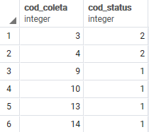
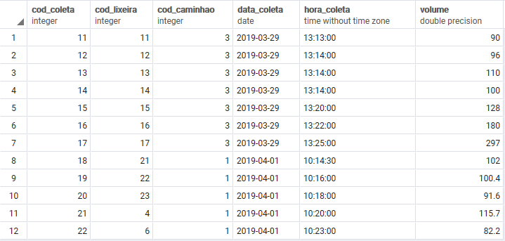
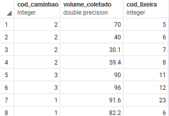
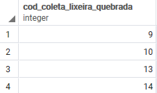
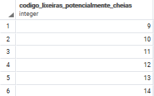
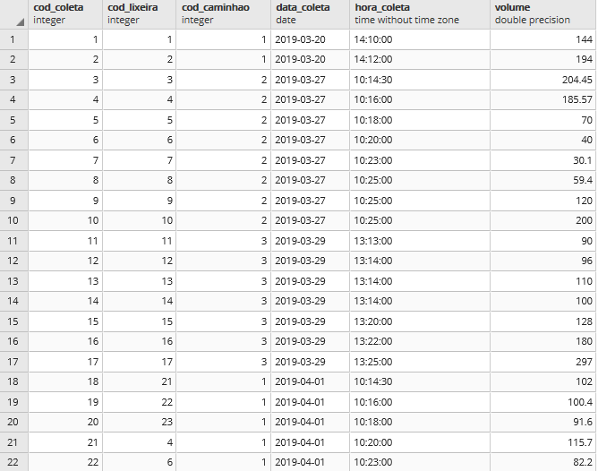
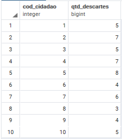

# TRABALHO 01:  Lixeira Inteligente
Trabalho desenvolvido durante a disciplina de BD1

# Sumário

### 1. COMPONENTES 
Integrantes do grupo 
Jackson William: jacksonwilliansilvaagostinho@gmail.com 
Lavinia Corteletti: laviniacort@gmail.com 
Thiago Moreira: thiago.moreira.ribeiro@gmail.com 
Vinicius Freitas: viniciusrocha28@gmail.com 

#
### 2.INTRODUÇÃO E MOTIVAÇAO 

O sistema Lixeira Inteligente é uma ferramenta intermediária que apoia o processo de descarte e coleta de lixo. A aplicação auxiliará os cidadãos a encontrar a lixeira mais próxima para que ele realize o descarte de seu lixo e auxiliará os coletores a percorrer o melhor trajeto para o recolhimento do lixo das lixeiras. Uma vez que o sistema indica ao cidadão uma lixeira que não esteja cheia,
ajuda a minimizar o problema de descarte de lixo de modo inapropriado, evitando que a cidade fique suja e, por consequência, dificultando a proliferação de insetos e transmissão de doenças. Por parte dos coletores, visa criar rotas otimizadas a fim de
diminuir o desperdício de recursos (gasolina, tempo de trabalho, entre outros) durante o processo. 

#
### 3.MINI-MUNDO 

A lixeira inteligente é lixeira fabricada com um sensor embutido. Ela possui um código de identificação, bairro, localização geográfica, capacidade máxima em volume. Ela consegue calcular o volume de lixo que foi descartado ou coletado. O sitema reconhe a lixeira como cheia quando o volume de lixo acumulado estiver acima de 70% da sua capacidade.

O cidadão que deseja usar o sistema deve realizar o cadastrado com a informação do seu nome e o número de telefone, além de permitir que a sua localização geográfica atual seja identificada. Ao cidadão usuário do sistema é apresentado a rota de descarte para a lixeira vazia mais próxima por meio de um sistema externo de mapas e navegação que recebe a localização do  cidadão e a localização da lixeira vazia para gerar a rota de descarte.

O funcionário motorista é caracterizado pelo seu nome e CNH. Ele dirige o caminhão coletor, e esse veículo é descrito por uma placa, marca, modelo, ano, capacidade máxima em volume, além de sua localização geográfica atual.

A rota de coleta que o caminhão irá percorrer é feita para um bairro e será gerada por um sistema externo de mapas e navegação
que receberá informações de localização do caminhão e das lixeira cheias, e assim, ele retornará a rota. Na criação da rota o sistema  só deve acrescentar as lixeiras inteligentes cheias cuja a soma total de volume de lixo contido não ultrapasse a capacidade do caminhão coletor. Outras lixeiras não cheias cujo ponto de localização geográfica encontrasse entre os pontos de localização das lixeiras cheias também devem ser acrescentadas na rota de coleta. Durante o processo de coleta de lixo pode ser registrado a situação operacional da lixeira pra informar, por exemplo, que ela está quebrada.

Para fins de relatório, informações de descarte serão registradas com os dados referentes à data, hora, o volume de lixo descartado e o responsável pelo descarte. Assim como o registro da coleta que terá informação da data, hora, o volume de lixo coletados e o responsável pela coleta. 

#
### 4.RASCUNHOS BÁSICOS DA INTERFACE (MOCKUPS) 

[Protótipo Tela Lixeira Inteligente](https://github.com/jalathivi/trab01/blob/master/arquivos/pdf/prototipo_tela_lixeira_inteligente.pdf) 

#### 4.1 QUAIS PERGUNTAS PODEM SER RESPONDIDAS COM O SISTEMA PROPOSTO?

- Relatório da quantidade de lixo coletado em cada bairro, em determinada rota.
- Relatório de uso da lixeira: quantidade de descartes que recebeu e o volume total descartado na mesma.
- Relatório de uso dos caminhões: contagem da frequência de alocação de cada veículo de coleta.
- Relatório da situação operacional das lixeiras que informe status das lixeiras e quantas lixeiras se encontram naquela situação.
- Relatório de listagem das lixeiras quebradas, informando seus dados para uma futura manutenção.

 
 
#### 4.2 TABELA DE DADOS DO SISTEMA:

[Tabela de Dados do Lixeira Inteligente](https://github.com/jalathivi/trab01/blob/master/arquivos/planilhas/tabelao.xlsx) 
[Tabela de Dados Normalizada do Lixeira Inteligente](https://github.com/jalathivi/trab01/blob/master/arquivos/planilhas/tabela_normalizada.xlsx) 

#
### 5.MODELO CONCEITUAL 

<b>NOTACAO ENTIDADE RELACIONAMENTO<b>

 
<b>NOTACAO UML<b>
	

#### 5.1 Validação do Modelo Conceitual
<b>[Lista de Compras Online]</b>: [Matheus Garcias, Letícia Teixeira, Júlia Miranda, Henrique Bastos] 
<b>[Tratamento Efetivo]</b>: [Ana Carolina, Pedro Henrique, Emanuel Medeiros, Filipe Ribeiro]

#### 5.2 DECISÕES DE PROJETO

<b>email </b> : Determinamos o atributo como simples, pois apenas um único e-mail será necessário;

<b>longitude / latitude</b> : Optamos por manter os atributos que corresponde as coordenadas de latitude e longitude separados para facilitar a manipulação do mesmo;

<b> data / hora </b> : Optamos por manter os atributos que correspondem a data e a hora de modos separados para ter um controle mais preciso das informações e seus registros, visando também futuras buscas e relatórios a serem gerados;

#### 5.3 DESCRIÇÃO DOS DADOS 

<b>CIDADAO</b>: tabela que armazena as informações relativas ao cidadão.
- cod_cidadao: Identifica um cidadão específico.
- nome: nome do cidadão.
- email: e-mail de login do cidadão.
- senha: senha criptografada de login do cidadão.
- longitude: contém a longitude do atual do cidadão.
- latitude: contém a latitude atual do cidadão.
 

<b>DESCARTE</b>: tabela que descreve a operação de descarte entre cidadão e lixeira.
- volume: volume de lixo descartado por um cidadão.
- data_descarte: dia, mês e ano da operação de descarte.
- hora_descarte: horário da operação de descarte.
 

<b>LIXEIRA</b>: tabela que descreve as informações sobre as lixeiras. 	
- cod_lixeira: identifica uma lixeira específica.
- longitude: contém a longitude da lixeira.
- latitude: contém a latitude da lixeira.
- capacidade: volume máximo suportado.
 

<b>BAIRRO</b>: tabela que descreve as informações sobre os bairros.
- cod_bairro: identifica um bairro específico.
- nome: nome da bairro.
 

<b>SITUACAO_OPERACIONAL</b>: tabela que possui registro da situação operacional das lixeiras.
- data_status: dia mês e ano do registro.
- hora_status: horário do registro.
 

<b>STATUS</b>: tabela que descreve as informações de status.
- cod_status: identifica um status específico.
- descrição: descreve uma situção da lixeira.
 

<b>COLETA</b>: tabela que descreve as operação entre caminhão coletor e a lixeira.	
- cod_coleta: identifica um registro de coleta.
- volume: volume de lixo recolhido da lixeira.
- data_coleta: dia, mês e ano da operação de coleta.
- hora_coleta: horário da operação de coleta.
 

<b>CAMINHAO</b>: tabela que descreve as informações do caminhão coletor.	
- cod_caminhao: identifica um caminhao específico.
- cod_modelo: referencia um modelo específico.
- longitude: longitude atual do caminhão.
- latitude: latitude atual do caminhão.
- placa: placa do caminhão.
- capacidade: volume máximo suportado pelo caminhão do coletor.
 

<b>MODELO</b>: tabela que descreve as informações do modelo do caminhão.	
- cod_coletor: identifica um modelo específico.
- nome: nome do modelo de caminhão.
- ano: ano de lançamento daquele modelo.
 

<b>MARCA</b>: tabela que descreve as informações da marca associada ao fabricante de caminhão.	
- cod_marca: identifica uma marca específico.
- nome: nome da marca.
 

<b>ALOCA</b>: tabela que descreve as informações sobre alocação de caminhão.	
- data_alocacao: data que ocorreu a alocação.
- hora_inic: hora inicial que o caminhão é alocado.
- hota_fim: hora prevista para a devolução do caminhão.
 

<b>MOTORISTA</b>: tabela que descreve as informações sobre o motorista.	
- cod_motorista: identifica um motorista específico.
- nome: nome do motorista.
- cnh: número da Carteira Nacional de Habilitação do motorista.
 

#
### 6	MODELO LÓGICO 

#
### 7	MODELO FÍSICO 
[Linhas de Criação das Tabelas para o Modelo Físico do BD](https://github.com/jalathivi/trab01/blob/master/arquivos/sql/modelo_fisico.sql) 
 
#        
### 8	INSERT APLICADO NAS TABELAS DO BANCO DE DADOS 
#### 8.1 DETALHAMENTO DAS INFORMAÇÕES
[Inserção das tabelas](https://github.com/jalathivi/trab01/blob/master/arquivos/sql/insert.sql) 

#### 8.2 INCLUSÃO DO SCRIPT PARA CRIAÇÃO DE TABELAS E INSERÇÃO DOS DADOS
[Criação e Inserção das tabelas](https://github.com/jalathivi/trab01/blob/master/arquivos/sql/create_insert.sql) 

#### 8.3 INCLUSÃO DO SCRIPT PARA EXCLUSÃO DE TABELAS EXISTENTES, CRIAÇÃO DE TABELA NOVAS E INSERÇÃO DOS DADOS
[Criação, Inserção e Exclusão das tabelas](https://github.com/jalathivi/trab01/blob/master/arquivos/sql/create_insert_drop.sql) 

#### 8.4 PRINCIPAIS FLUXOS DE INFORMAÇÃO E PRINCIPAIS TABELAS DO SISTEMA
##### Os principais fluxos de dados de informação no sistema em desenvolvimento
- Descarte (Volume de lixo descartados nas lixeiras, envolve os cidadãos e as lixeiras)
- Coleta (Volume de lixo coletados nas lixeiras, envolve os caminhãos e as lixeiras)
- Situacao_Operacional (Status operacional das lixeiras, envolve a coleta e os status das lixeiras)
- Aloca (Registro alocação dos caminhãos pelos coletores, envolve os motoristas e os caminhãos)
##### As tabelas que conterão mais dados no sistema em desenvolvimento
- Descarte 
- Coleta
- Cidadao
##### As 5 principais tabelas do sistema em desenvolvimento
- Descarte 
- Coleta 
- Cidadao 
- Caminhao
- Lixeira

#
### 9	TABELAS E PRINCIPAIS CONSULTAS 
#### 9.1	CONSULTAS DAS TABELAS COM TODOS OS DADOS INSERIDOS (Todas)  
    SELECT*FROM ALOCA;
  

    SELECT*FROM CAMINHAO;
  

    SELECT*FROM MARCA;
  

    SELECT*FROM MODELO;
  

    SELECT*FROM MOTORISTA;
  

    SELECT*FROM BAIRRO;
  

    SELECT*FROM CIDADAO;
  

    SELECT*FROM COLETA;
  

    SELECT*FROM DESCARTE;
  

    SELECT*FROM LIXEIRA;
  

    SELECT*FROM SITUACAO_OPERACIONAL;
  

    SELECT*FROM STATUS;
  

#### 9.2	CONSULTAS DAS TABELAS COM FILTROS WHERE (Mínimo 4) 
    SELECT * FROM lixeira WHERE capacidade > 120;
  

    SELECT * FROM cidadao WHERE email = 'maria_lu@gmail.com';
  

    SELECT * FROM bairro WHERE cod_bairro = '4';
  

    SELECT * FROM situacao_operacional WHERE cod_status = 1;
  

    SELECT * FROM coleta WHERE data_coleta > '2019-03-24';
  

    SELECT * FROM descarte WHERE hora_descarte < '08:00:00';
 

#### 9.3	CONSULTAS QUE USAM OPERADORES LÓGICOS, ARITMÉTICOS E TABELAS OU CAMPOS RENOMEADOS (Mínimo 11) 
  

    SELECT * FROM coleta WHERE volume < 50 AND data_coleta = '2019-03-27';
  

	SELECT * FROM lixeira WHERE capacidade > 200 AND NOT cod_bairro = 3;
  

	SELECT * FROM situacao_operacional WHERE cod_status = 1 OR cod_status = 2;
  

	SELECT * FROM caminhao WHERE cod_modelo = 2 OR capacidade >= 11000;
  
	
	SELECT * FROM descarte WHERE NOT data_descarte = '2019-03-27' AND cod_cidadao = 1;
  

	SELECT * FROM modelo where ano > 2010 AND NOT cod_marca = 1;
  

	SELECT cod_cidadao, volume as volume_descartado FROM descarte WHERE volume >100;
  

	SELECT cod_caminhao,volume as volume_coletado, cod_lixeira FROM coleta where volume < 100;
  

	SELECT cod_coleta as cod_coleta_lixeira_quebrada FROM situacao_operacional WHERE cod_status = 1;
  

	SELECT cod_Lixeira as codigo_Lixeiras_potencialmente_Cheias FROM descarte WHERE volume >= 90;	
  

	SELECT cod_coleta as codigo_coleta_Lixeira_Transbordando FROM situacao_operacional WHERE cod_status = 2;	
  

#### 9.4	CONSULTAS QUE USAM OPERADORES LIKE E DATAS (Mínimo 12)  
    SELECT*FROM bairro WHERE nome ILIKE '%jardim%';
  

    SELECT*FROM cidadao WHERE nome LIKE 'L%';
  

    SELECT*FROM coletor WHERE placa LIKE '_T%';
  

    SELECT * FROM marca WHERE nome ILIKE 'MERCEDES BENZ';
  

    SELECT*FROM motorista WHERE nome ILIKE '%b%';
  
 
    b) Criar uma consulta para cada tipo de função data apresentada.
    
    SELECT*FROM coleta WHERE CURRENT_DATE - data_coleta > 47;
  
    
    SELECT cod_caminhao, cod_lixeira, age(data_coleta,'2019-03-01')AS intervalo_2019_03_01 FROM coleta limit 5;
  
    
    SELECT cod_cidadao, cod_lixeira, date_part('hour',hora_descarte) AS hora FROM descarte limit 5; 
  
    
    SELECT cod_cidadao, cod_lixeira, date_part('minute',hora_descarte) AS minutos FROM descarte limit 5;
  
    
    SELECT cod_caminhao, cod_lixeira, EXTRACT('year' FROM data_coleta) AS Anocoleta FROM coleta limit 5;
  
    
    SELECT cod_cidadao, cod_lixeira, EXTRACT('month' FROM data_descarte) AS mesDescarte FROM descarte limit 5;
  
    
   SELECT cod_cidadao, cod_lixeira, EXTRACT('day' FROM data_descarte) AS diaDescarte FROM descarte limit 5;
  
    
    SELECT*, age('2020-01-01',data_coleta) as manutencao_obrigatoria from coleta limit 5;
  

#### 9.5	ATUALIZAÇÃO E EXCLUSÃO DE DADOS (Mínimo 6) 

>## Marco de Entrega 07 em: (20/05/2019) 

    UPDATE BAIRRO SET nome = 'Jardim Limoeiro' WHERE cod_bairro = 6;
  

    UPDATE CIDADAO SET latitude = -40.2172186 WHERE nome LIKE 'L%';
     

    UPDATE COLETA SET volume = volume*1.1;
      

    DELETE FROM DESCARTE WHERE volume <=100;
      

    DELETE FROM COLETA WHERE cod_caminhao = 1;
     

    DELETE FROM MOTORISTA WHERE cnh = '79422697522'; 
  

#### 9.6	CONSULTAS COM JUNÇÃO E ORDENAÇÃO (Mínimo 6) 
	
	SELECT  
		bairro.nome as Bairro,
		cidadao.nome as Cidadao, 
		coleta.volume, 
		caminhao.placa, 
		descarte.data_descarte,
		lixeira.cod_lixeira,
		situacao_operacional.cod_status,
		status.descricao
	FROM LIXEIRA 
	INNER JOIN COLETA ON (LIXEIRA.COD_lixeira = COLETA.COD_lixeira) 
	INNER JOIN BAIRRO ON (LIXEIRA.COD_BAIRRO = BAIRRO.COD_BAIRRO)
	INNER JOIN DESCARTE ON (LIXEIRA.COD_LIXEIRA = DESCARTE.COD_LIXEIRA)
	INNER JOIN CIDADAO ON (CIDADAO.COD_CIDADAO = DESCARTE.COD_CIDADAO)
	INNER JOIN CAMINHAO ON (CAMINHAO.COD_CAMINHAO = COLETA.COD_CAMINHAO)
	INNER JOIN SITUACAO_OPERACIONAL ON (SITUACAO_OPERACIONAL.COD_COLETA = COLETA.COD_COLETA)
	INNER JOIN STATUS ON (SITUACAO_OPERACIONAL.COD_STATUS = STATUS.COD_STATUS)
	ORDER BY bairro.nome;
  

	SELECT 
		lixeira.cod_lixeira,
		descricao as descricao_status, 
		data_coleta, 
		hora_coleta
	FROM LIXEIRA 
	INNER JOIN COLETA ON (LIXEIRA.cod_lixeira = COLETA.cod_coleta)
	INNER JOIN SITUACAO_OPERACIONAL ON (COLETA.cod_coleta = SITUACAO_OPERACIONAL.cod_coleta)
	INNER JOIN STATUS ON (SITUACAO_OPERACIONAL.cod_status = STATUS.cod_status)
	ORDER BY lixeira.cod_lixeira, data_coleta;
  	

	SELECT 
		lixeira.cod_lixeira,
		bairro.nome,
		latitude,
		longitude
	FROM LIXEIRA 
	INNER JOIN BAIRRO ON (LIXEIRA.cod_bairro = BAIRRO.cod_bairro) 
	ORDER BY lixeira.cod_lixeira LIMIT 10;
  

	SELECT
		cidadao.cod_cidadao,
		cidadao.nome,
		descarte.cod_lixeira,
		volume as volume_descarte,
		data_descarte,
		hora_descarte
	FROM CIDADAO 
	INNER JOIN DESCARTE ON (CIDADAO.cod_cidadao = DESCARTE.cod_cidadao)
	ORDER BY cidadao.cod_cidadao 
	LIMIT 10 OFFSET 11;
  

	SELECT
		cidadao.cod_cidadao,
		cidadao.latitude as cidadao_latitude,
		cidadao.longitude as cidadao_longitude,
		descarte.cod_lixeira,
		descarte.volume as volume_descarte,
		lixeira.capacidade,
		lixeira.latitude as lixeira_latitude,
		lixeira.longitude as lixeira_longitude
	FROM CIDADAO 
	INNER JOIN DESCARTE ON (CIDADAO.cod_cidadao = DESCARTE.cod_cidadao)
	INNER JOIN LIXEIRA ON (DESCARTE.cod_lixeira = LIXEIRA.cod_lixeira)
	ORDER BY cidadao.cod_cidadao
	LIMIT 10;
  

	SELECT
		caminhao.cod_caminhao,
		caminhao.placa,
		coleta.cod_lixeira,
		volume as volume_coleta,
		data_coleta,
		hora_coleta
	FROM CAMINHAO 
	INNER JOIN COLETA ON (CAMINHAO.cod_caminhao = COLETA.cod_caminhao)
	ORDER BY caminhao.cod_caminhao, caminhao.placa
	LIMIT 10;
  

	SELECT
		caminhao.cod_caminhao,
		caminhao.latitude,
		caminhao.longitude,
		caminhao.capacidade,
		lixeira.cod_lixeira,
		lixeira.latitude,
		lixeira.longitude
	FROM CAMINHAO 
	INNER JOIN COLETA ON (CAMINHAO.cod_caminhao = COLETA.cod_caminhao)
	INNER JOIN LIXEIRA ON (COLETA.cod_lixeira = LIXEIRA.cod_lixeira)
	ORDER BY caminhao.cod_caminhao;
  

        
>## Marco de Entrega 08 em: (21/05/2019) 
        
#### 9.7	CONSULTAS COM GROUP BY E FUNÇÕES DE AGRUPAMENTO (Mínimo 6) 

	SELECT cidadao.nome, COUNT(*) AS QTD_Descartes 
	FROM descarte INNER JOIN cidadao ON (cidadao.cod_cidadao = descarte.cod_cidadao) GROUP BY cidadao.nome ORDER BY cidadao.nome;
  

	SELECT SUM(volume) AS Volume_Coletado, coleta.data_coleta 
	FROM coleta GROUP BY coleta.data_coleta;
  

	SELECT bairro.nome, COUNT(*) AS QTD_Lixeiras 
	FROM lixeira INNER JOIN bairro ON (bairro.cod_bairro = lixeira.cod_bairro) GROUP BY bairro.cod_bairro ORDER BY COUNT(*);
  

	SELECT capacidade AS Capacidades 
	FROM lixeira GROUP BY capacidade ORDER BY capacidade;
  

	SELECT cod_status, COUNT(*)
	FROM situacao_operacional GROUP BY cod_status;
  

	
	SELECT cod_cidadao, COUNT(*) AS QTD_DESCARTES 
	FROM descarte GROUP BY cod_cidadao ORDER BY cod_cidadao;
  

#### 9.8	CONSULTAS COM LEFT E RIGHT JOIN (Mínimo 4) 
	
	
	SELECT cod_lixeira, bairro.nome, capacidade 
	FROM bairro RIGHT OUTER JOIN lixeira ON (lixeira.cod_bairro = bairro.cod_bairro);
  

	SELECT marca.nome, modelo.nome, modelo.ano, caminhao.placa, caminhao.capacidade 
	FROM marca LEFT OUTER JOIN modelo ON (marca.cod_marca = modelo.cod_marca) 
	LEFT OUTER JOIN caminhao ON (modelo.cod_modelo = caminhao.cod_modelo);
  

	SELECT motorista.nome, aloca.data_alocacao, aloca.hora_inic, aloca.hora_fim, caminhao.placa 
	FROM motorista RIGHT OUTER JOIN aloca ON (motorista.cod_motorista = aloca.cod_motorista) 
	LEFT OUTER JOIN caminhao ON (aloca.cod_caminhao = caminhao.cod_caminhao) ORDER BY nome;
  

	SELECT situacao_operacional.cod_status, status.descricao 
	FROM situacao_operacional RIGHT OUTER JOIN status ON (situacao_operacional.cod_status = status.cod_status);
  

#### 9.9	CONSULTAS COM SELF JOIN E VIEW (Mínimo 6) 

	CREATE VIEW lixeiraComLixo AS 
	SELECT lixeira.cod_lixeira,
	lixeira.capacidade, 
	SUM(descarte.volume) AS volumeAtual,
	(SUM(descarte.volume)/lixeira.capacidade) as nivel_Atual,
	bairro.nome as bairro FROM lixeira
	FULL OUTER JOIN descarte ON (lixeira.cod_lixeira = descarte.cod_lixeira)
	FULL OUTER JOIN coleta ON (descarte.cod_lixeira = coleta.cod_lixeira)
	FULL OUTER JOIN bairro ON (bairro.cod_bairro = lixeira.cod_bairro)
	WHERE descarte.data_descarte > coleta.data_coleta 
	OR (descarte.data_descarte = coleta.data_coleta AND descarte.hora_descarte > coleta.hora_coleta)
	GROUP BY lixeira.cod_lixeira, lixeira.capacidade, bairro
	ORDER BY lixeira.cod_lixeira
  

	CREATE VIEW lixeiraVazia AS 
	SELECT lixeira.cod_lixeira, bairro.nome as bairro FROM lixeira 
	INNER JOIN bairro ON (bairro.cod_bairro = lixeira.cod_bairro)
	WHERE cod_lixeira NOT IN ( SELECT descarte.cod_lixeira FROM descarte LEFT OUTER JOIN coleta ON (descarte.cod_lixeira = coleta.cod_lixeira) 
	WHERE descarte.data_descarte > coleta.data_coleta OR (descarte.data_descarte = coleta.data_coleta AND descarte.hora_descarte > coleta.hora_coleta) 
	GROUP BY descarte.cod_lixeira ORDER BY descarte.cod_lixeira)
  

	CREATE VIEW lixeiraColetada AS
	SELECT coleta.cod_lixeira, coleta.volume, bairro.nome AS bairro FROM coleta
	INNER JOIN lixeira ON (lixeira.cod_lixeira = coleta.cod_lixeira)
	INNER JOIN bairro ON (bairro.cod_bairro = lixeira.cod_bairro)
	WHERE coleta.data_coleta IN (SELECT DISTINCT coleta.data_coleta FROM coleta ORDER BY coleta.data_coleta DESC LIMIT 1) 
  

	CREATE VIEW lixeiraSituacaoOperacional AS
	SELECT coleta.cod_lixeira, status.descricao AS situacao_lixeira, coleta.data_coleta AS data_registro FROM situacao_operacional
	INNER JOIN  coleta ON (coleta.cod_coleta =  situacao_operacional.cod_coleta)
	INNER JOIN status ON (status.cod_status = situacao_operacional.cod_status)
	ORDER BY coleta.data_coleta, coleta.cod_lixeira
  

	CREATE VIEW alocacao AS
	SELECT motorista.nome as nome_motorista, caminhao.placa as placa_caminhao, aloca.data_alocacao, aloca.hora_inic as hora_alocacao FROM aloca
	INNER JOIN  motorista ON (motorista.cod_motorista =  aloca.cod_motorista)
	INNER JOIN caminhao ON (caminhao.cod_caminhao = aloca.cod_caminhao)
	ORDER BY aloca.data_alocacao, aloca.hora_inic, motorista.nome 
  

	CREATE VIEW lixeiraCheia AS 
	SELECT descarte.cod_lixeira, SUM(descarte.volume) AS volume, bairro.nome as bairro FROM descarte 
	LEFT OUTER JOIN coleta ON (descarte.cod_lixeira = coleta.cod_lixeira)
	INNER JOIN lixeira ON (lixeira.cod_lixeira = descarte.cod_lixeira)
	INNER JOIN bairro ON (bairro.cod_bairro = lixeira.cod_bairro)
	WHERE descarte.data_descarte > coleta.data_coleta GROUP BY descarte.cod_lixeira, lixeira.capacidade, bairro.nome
	HAVING SUM(descarte.volume) > (lixeira.capacidade * 0.7)
	ORDER BY descarte.cod_lixeira
  
			
#### 9.10	SUBCONSULTAS (Mínimo 3) 

	SELECT DISTINCT nome as modelo_de_caminhao FROM modelo 
	WHERE nome IN (SELECT DISTINCT nome FROM modelo WHERE nome <> 'VW 8150')
  

	SELECT lixeira.cod_lixeira, bairro.nome as bairro FROM lixeira 
	INNER JOIN bairro ON (bairro.cod_bairro = lixeira.cod_bairro)
	WHERE cod_lixeira NOT IN (SELECT descarte.cod_lixeira FROM descarte LEFT OUTER JOIN coleta ON (descarte.cod_lixeira = coleta.cod_lixeira)
	WHERE descarte.data_descarte > coleta.data_coleta  GROUP BY descarte.cod_lixeira 
	ORDER BY descarte.cod_lixeira)
  

	SELECT coleta.cod_lixeira, coleta.volume, bairro.nome AS bairro FROM coleta
	INNER JOIN lixeira ON (lixeira.cod_lixeira = coleta.cod_lixeira)
	INNER JOIN bairro ON (bairro.cod_bairro = lixeira.cod_bairro)
	WHERE coleta.data_coleta IN (SELECT DISTINCT coleta.data_coleta FROM coleta ORDER BY coleta.data_coleta DESC LIMIT 1) 
  

#### 9.11 Relatórios e Gráficos 
[Relatórios usando Jupyter](https://github.com/jalathivi/trab01/blob/master/arquivos/relatorio/relatorios.ipynb) 

>## Marco de Entrega 11 em: (04/06/2019) 

### 10	ATUALIZAÇÃO DA DOCUMENTAÇÃO DOS SLIDES PARA APRESENTAÇAO FINAL (Mínimo 6 e Máximo 10) 
#### a) Pontos Chave do MINI-MUNDO
#### b) 5 principais tabelas/fluxos do sistema
#### c) Perguntas que podem ser respondidads com o sistema proposto
#### d) Modelo Conceitual
#### e) Modelo Lógico
#### f) Relatórios e Gráficos mais importantes para o sistema (mínimo 5) 
#### --> Tempo de apresentação 10 minutos

### 11 Backup completo do banco de dados postgres
	
Arquivo de Backup: [ColetaInteligente.backup](https://github.com/jalathivi/trab01/blob/master/arquivos/backup/ColetaInteligente.backup) 
<b>[Grupo responsável por testar/restaurar o banco de dados]</b>: [Lista de Compras Online]: [Matheus Garcias, Letícia Teixeira, Júlia Miranda, Henrique Bastos]  

### 12	TUTORIAL COMPLETO DE PASSOS PARA RESTAURACAO DO BANCO E EXECUCAO DE PROCEDIMENTOS ENVOLVIDOS NO TRABALHO PARA OBTENÇÃO DOS RESULTADOS 
Arquivo Tutorial: [Tutorial.pdf](https://github.com/jalathivi/trab01/blob/master/arquivos/pdf/tutorial_restauracao_e_execucao_procedimentos.pdf) 
        
### 13   DIFICULDADES ENCONTRADAS PELO GRUPO 
>## Marco de Entrega Final em: 11/06/2019  
        
### 14  FORMATACAO NO GIT: https://help.github.com/articles/basic-writing-and-formatting-syntax/
<comentario no git>
    
##### About Formatting
    https://help.github.com/articles/about-writing-and-formatting-on-github/
    
##### Basic Formatting in Git
    
    https://help.github.com/articles/basic-writing-and-formatting-syntax/#referencing-issues-and-pull-requests
    
    
##### Working with advanced formatting
    https://help.github.com/articles/working-with-advanced-formatting/
#### Mastering Markdown
    https://guides.github.com/features/mastering-markdown/

    

    
### OBSERVAÇÕES IMPORTANTES

#### Todos os arquivos que fazem parte do projeto (Imagens, pdfs, arquivos fonte, etc..), devem estar presentes no GIT. Os arquivos do projeto vigente não devem ser armazenados em quaisquer outras plataformas.
1. <strong>Caso existam arquivos com conteúdos sigilosos<strong>, comunicar o professor que definirá em conjunto com o grupo a melhor forma de armazenamento do arquivo.

#### Todos os grupos deverão fazer Fork deste repositório e dar permissões administrativas ao usuário do git "profmoisesomena", para acompanhamento do trabalho.

#### Os usuários criados no GIT devem possuir o nome de identificação do aluno (não serão aceitos nomes como Eu123, meuprojeto, pro456, etc). Em caso de dúvida comunicar o professor.

Link para BrModelo: 
http://www.sis4.com/brModelo/download.html
 

Link para curso de GIT 

