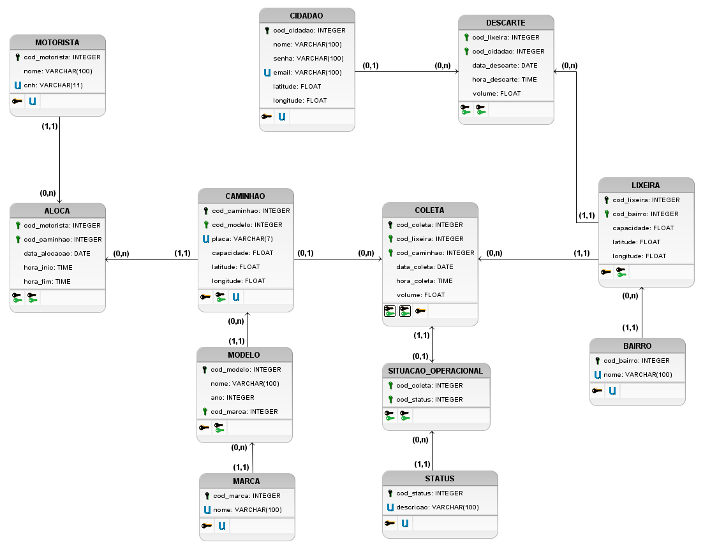
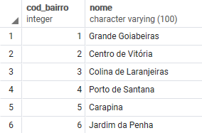
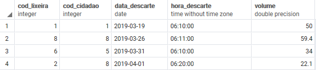
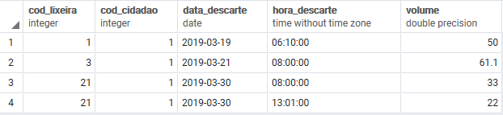

# TRABALHO 01:  Lixeira Inteligente
Trabalho desenvolvido durante a disciplina de BD1

# Sumário

### 1. COMPONENTES 
Integrantes do grupo 
Jackson William: jacksonwilliansilvaagostinho@gmail.com 
Lavinia Corteletti: laviniacort@gmail.com 
Thiago Moreira: thiago.moreira.ribeiro@gmail.com 
Vinicius Freitas: viniciusrocha28@gmail.com 

#
### 2.INTRODUÇÃO E MOTIVAÇAO 

O sistema Lixeira Inteligente tem como objetivo auxiliar na coleta e no descarte de lixo. A aplicação auxiliará os cidadãos a encontrar a lixeira mais próxima disponível para o descarte e os coletores a percorrer o melhor trajeto  para o recolhimento de  resíduos das lixeiras consideradas como cheias.  Esse sistema tenta minimizar o problema de descarte de lixo de modo inapropriado, evitando que a cidade fique suja, e também visa criar rotas otimizadas para os coletores a fim de diminuir o desperdício de recursos durante o processo. 
 
 
#
### 3.MINI-MUNDO 

O sistema Lixeira Inteligente precisa armazenar as seguintes informações. Sobre o bairro é preciso armazenar o código do bairro e nome do bairro. Sobre a lixeira é necessário armazenar o código da lixeira, código do bairro, localização (longitude e latitude), volume máximo, volume atual de lixo, data/hora da atualização do volume. A lixeira tem Status de Situação Operacional, composto pelo código da lixeira, código do coletor, status, descrição e data/hora. Sobre o cidadão será armazenado o código do cidadão, nome, email, senha e a sua localização (longitude e latitude). Para o coletor é preciso armazenar o código do coletor,  localização atual (longitude e latitude), placa, marca, modelo, ano, volume máximo. A versão do aplicativo voltado para o cidadão necessita do cadastro do mesmo  para permitir visualizar  as lixeiras mais próximas de sua localização com o menor volume de lixo contido.  A versão do aplicativo voltado para os coletores apresentará o melhor caminho para realizar a coleta no bairro selecionado, além de permitir que ele atualize o status operacional da lixeira. A rota será criada com base na prioridade de coleta, ou seja, a necessidade de recolher os lixos nas lixeiras das quais atingirem o volume de resíduo maior ou igual a 70% do seu volume máximo.  Somente um administrador poderá alterar as rotas. 

#
### 4.RASCUNHOS BÁSICOS DA INTERFACE (MOCKUPS) 

[Protótipo Lixeira Inteligente - Cidadão](https://github.com/jalathivi/trab01/blob/master/arquivos/sql/pdf/prototipo_cidadao.pdf) 
[Protótipo Lixeira Inteligente - Motorista](https://github.com/jalathivi/trab01/blob/master/arquivos/sql/pdf/prototipo_motorista.pdf) 

#### 4.1 QUAIS PERGUNTAS PODEM SER RESPONDIDAS COM O SISTEMA PROPOSTO?

- Relatório do volume atual das lixeiras que informe: código da lixeira, data e hora  da última atualização, seu volume anterior e o atual;
- Relatório das lixeiras próximas disponíveis para descarte que informe: coordenadas e códigos das lixeiras próximas;  
- Relatório das lixeiras que atingiram nível igual ou superior a 70% da capacidade máxima que informe: código e nível de preenchimento das lixeiras;
- Relatório da rota otimizada para o motorista que informe a rota e o seu tempo médio estimado;
- Relatório da situação operante das lixeiras que informe: status operacionais das lixeiras, por exemplo: "Quebrada".

 
 
#### 4.2 TABELA DE DADOS DO SISTEMA:

[Tabela de Dados do Lixeira Inteligente](https://github.com/jalathivi/trab01/blob/master/arquivos/planilhas/tabelao.xlsx) 
[Tabela de Dados Normalizada do Lixeira Inteligente](https://github.com/jalathivi/trab01/blob/master/arquivos/planilhas/tabela_normalizada.xlsx) 

#
### 5.MODELO CONCEITUAL 

#### 5.1 Validação do Modelo Conceitual
<b>[Lista de Compras Online]</b>: [Matheus Garcias, Letícia Teixeira, Júlia Miranda, Henrique Bastos] 
<b>[Tratamento Efetivo]</b>: [Ana Carolina, Pedro Henrique, Emanuel Medeiros, Filipe Ribeiro]

#### 5.2 DECISÕES DE PROJETO

<b>email </b> : Determinamos o atributo como simples, pois apenas um único e-mail será necessário;

<b>longitude / latitude</b> : Optamos por manter os atributos que corresponde as coordenadas de latitude e longitude separados para facilitar a manipulação do mesmo;

<b> data / hora </b> : Optamos por manter os atributos que correspondem a data e a hora de modos separados para ter um controle mais preciso das informações e seus registros, visando também futuras buscas e relatórios a serem gerados;

#### 5.3 DESCRIÇÃO DOS DADOS 

<b>CIDADAO</b>: tabela que armazena as informações relativas ao cidadão.
- cod_cidadao: Identifica um cidadão específico.
- nome: nome do cidadão.
- email: e-mail de login do cidadão.
- senha: senha criptografada de login do cidadão.
- longitude: contém a longitude do atual do cidadão.
- latitude: contém a latitude atual do cidadão.
 

<b>DESCARTE</b>: tabela que descreve a operação de descarte entre cidadão e lixeira.
- volume: volume de lixo descartado por um cidadão.
- data_descarte: dia, mês e ano da operação de descarte.
- hora_descarte: horário da operação de descarte.
 

<b>LIXEIRA</b>: tabela que descreve as informações sobre as lixeiras. 	
- cod_lixeira: identifica uma lixeira específica.
- longitude: contém a longitude da lixeira.
- latitude: contém a latitude da lixeira.
- capacidade: volume máximo suportado.
 

<b>BAIRRO</b>: tabela que descreve as informações sobre os bairros.
- cod_bairro: identifica um bairro específico.
- nome: nome da bairro.
 

<b>SITUACAO_OPERACIONAL</b>: tabela que possui registro da situação operacional das lixeiras.
- data_status: dia mês e ano do registro.
- hora_status: horário do registro.
 

<b>STATUS</b>: tabela que descreve as informações de status.
- cod_status: identifica um status específico.
- descrição: descreve uma situção da lixeira.
 

<b>COLETA</b>: tabela que descreve as operação entre caminhão coletor e a lixeira.	
- cod_coleta: identifica um registro de coleta.
- volume: volume de lixo recolhido da lixeira.
- data_coleta: dia, mês e ano da operação de coleta.
- hora_coleta: horário da operação de coleta.
 

<b>CAMINHAO</b>: tabela que descreve as informações do caminhão coletor.	
- cod_caminhao: identifica um caminhao específico.
- cod_modelo: referencia um modelo específico.
- longitude: longitude atual do caminhão.
- latitude: latitude atual do caminhão.
- placa: placa do caminhão.
- capacidade: volume máximo suportado pelo caminhão do coletor.
 

<b>MODELO</b>: tabela que descreve as informações do modelo do caminhão.	
- cod_coletor: identifica um modelo específico.
- nome: nome do modelo de caminhão.
- ano: ano de lançamento daquele modelo.
 

<b>MARCA</b>: tabela que descreve as informações da marca associada ao fabricante de caminhão.	
- cod_marca: identifica uma marca específico.
- nome: nome da marca.
 

<b>ALOCA</b>: tabela que descreve as informações sobre alocação de caminhão.	
- data_alocacao: data que ocorreu a alocação.
- hora_inic: hora inicial que o caminhão é alocado.
- hota_fim: hora prevista para a devolução do caminhão.
 

<b>MOTORISTA</b>: tabela que descreve as informações sobre o motorista.	
- cod_motorista: identifica um motorista específico.
- nome: nome do motorista.
- cnh: número da Carteira Nacional de Habilitação do motorista.
 

#
### 6	MODELO LÓGICO 

#
### 7	MODELO FÍSICO 
[Linhas de Criação das Tabelas para o Modelo Físico do BD](https://github.com/jalathivi/trab01/blob/master/arquivos/sql/modelo_fisico.sql) 
 
#        
### 8	INSERT APLICADO NAS TABELAS DO BANCO DE DADOS 
#### 8.1 DETALHAMENTO DAS INFORMAÇÕES
[Inserção das tabelas](https://github.com/jalathivi/trab01/blob/master/arquivos/sql/insert.sql) 

#### 8.2 INCLUSÃO DO SCRIPT PARA CRIAÇÃO DE TABELAS E INSERÇÃO DOS DADOS
[Criação e Inserção das tabelas](https://github.com/jalathivi/trab01/blob/master/arquivos/sql/create_insert.sql) 

#### 8.3 INCLUSÃO DO SCRIPT PARA EXCLUSÃO DE TABELAS EXISTENTES, CRIAÇÃO DE TABELA NOVAS E INSERÇÃO DOS DADOS
[Criação, Inserção e Exclusão das tabelas](https://github.com/jalathivi/trab01/blob/master/arquivos/sql/create_insert_drop.sql) 

#### 8.4 PRINCIPAIS FLUXOS DE INFORMAÇÃO E PRINCIPAIS TABELAS DO SISTEMA
##### Os principais fluxos de dados de informação no sistema em desenvolvimento
- Descarte (Volume de lixo descartados nas lixeiras, envolve os cidadãos e as lixeiras)
- Coleta (Volume de lixo coletados nas lixeiras, envolve os caminhãos e as lixeiras)
- Situacao_Operacional (Status operacional das lixeiras, envolve a coleta e os status das lixeiras)
- Aloca (Registro alocação dos caminhãos pelos coletores, envolve os motoristas e os caminhãos)
##### As tabelas que conterão mais dados no sistema em desenvolvimento
- Descarte 
- Coleta
- Cidadao
##### As 5 principais tabelas do sistema em desenvolvimento
- Descarte 
- Coleta 
- Cidadao 
- Caminhao
- Lixeira

#
### 9	TABELAS E PRINCIPAIS CONSULTAS 
#### 9.1	CONSULTAS DAS TABELAS COM TODOS OS DADOS INSERIDOS (Todas)  
    SELECT*FROM ALOCA;
  

    SELECT*FROM CAMINHAO;
  

    SELECT*FROM MARCA;
  

    SELECT*FROM MODELO;
  

    SELECT*FROM MOTORISTA;
  

    SELECT*FROM BAIRRO;
  

    SELECT*FROM CIDADAO;
  

    SELECT*FROM COLETA;
  

    SELECT*FROM DESCARTE;
  

    SELECT*FROM LIXEIRA;
  

    SELECT*FROM SITUACAO_OPERACIONAL;
  

    SELECT*FROM STATUS;
  

#### 9.2	CONSULTAS DAS TABELAS COM FILTROS WHERE (Mínimo 4) 
    SELECT * FROM lixeira WHERE capacidade > 120;
  

    SELECT * FROM cidadao WHERE email = 'maria_lu@gmail.com';
  

    SELECT * FROM bairro WHERE cod_bairro = '4';
  

    SELECT * FROM situacao_operacional WHERE cod_status = 1;
  

    SELECT * FROM coleta WHERE data_coleta > '2019-03-24';
  

    SELECT * FROM descarte WHERE hora_descarte < '08:00:00';
 

#### 9.3	CONSULTAS QUE USAM OPERADORES LÓGICOS, ARITMÉTICOS E TABELAS OU CAMPOS RENOMEADOS (Mínimo 11) 
  

    SELECT * FROM coleta WHERE volume < 50 AND data_coleta = '2019-03-27';
  

	SELECT * FROM lixeira WHERE capacidade > 200 AND NOT nivel_atual = 0;
  

	SELECT * FROM situacao_operacional WHERE cod_status = 1 OR cod_status = 2;
  

	SELECT * FROM coletor WHERE marca = 'Volvo' OR ano = 2019;
  
	
	SELECT * FROM descarte WHERE NOT data_descarte = '2019-03-27';
  

	SELECT capacidade, nivel_atual, capacidade - ((capacidade * nivel_atual)/100) AS capacidade_disponivel
	FROM lixeira WHERE NOT (capacidade - ((capacidade * nivel_atual)/100) ) < 0;
  

	SELECT capacidade, (capacidade * nivel_atual)/100 AS volume_preenchido FROM lixeira;
  

	SELECT capacidade, (capacidade*70)/100 capacidade_70p FROM lixeira;
  

	SELECT cod_Lixeira as codigo_Lixeiras_Quebradas FROM situacao_operacional WHERE cod_status = 1;	
  

	SELECT cod_Lixeira as codigo_Lixeiras_Cheias FROM lixeira WHERE nivel_atual >= 70;	
  

	SELECT cod_Lixeira as codigo_Lixeiras_Ok FROM situacao_operacional WHERE cod_status = 3;	
  

#### 9.4	CONSULTAS QUE USAM OPERADORES LIKE E DATAS (Mínimo 12)  
    SELECT*FROM bairro WHERE nome ILIKE '%jardim%';
  

    SELECT*FROM cidadao WHERE nome LIKE 'L%';
  

    SELECT*FROM coletor WHERE placa LIKE '_T%';
  

    SELECT*FROM coletor WHERE marca ILIKE 'MERCEDES BENZ';
  

    SELECT*FROM coletor WHERE modelo LIKE 'COLECOM';
   
 
    b) Criar uma consulta para cada tipo de função data apresentada.
    
    SELECT*FROM coleta WHERE CURRENT_DATE - data_coleta > 47;
  
    
    SELECT cod_coletor,cod_lixeira, age(data_coleta,'2019-03-01')AS intervalo_2019_03_01 FROM coleta; 
  
    
    SELECT cod_cidadao, cod_lixeira, date_part('hour',hora_descarte) AS hora FROM descarte;
  
    
    SELECT cod_cidadao, cod_lixeira, date_part('minute',hora_descarte) AS minutos FROM descarte;
  
    
    SELECT cod_cidadao, cod_lixeira, EXTRACT('year' FROM data_descarte) AS AnoDescarte FROM descarte;
  
    
    SELECT cod_cidadao, cod_lixeira, EXTRACT('month' FROM data_descarte) AS mesDescarte FROM descarte;
  
    
    SELECT cod_cidadao, cod_lixeira, EXTRACT('day' FROM data_descarte) AS diaDescarte FROM descarte;
  
    
    SELECT*, age('2020-01-01',data_status) as manutencao_obrigatoria from situacao_operacional;
  

#### 9.5	ATUALIZAÇÃO E EXCLUSÃO DE DADOS (Mínimo 6) 

>## Marco de Entrega 07 em: (20/05/2019) 

    UPDATE BAIRRO SET nome = 'Jardim Limoeiro' WHERE cod_bairro = 8;
  

    UPDATE CIDADAO SET latitude = -40.2172186 WHERE nome LIKE 'L%';
      

    UPDATE COLETA SET volume = volume*1.1;
      

    DELETE FROM DESCARTE WHERE volume <= 100;
      

    DELETE FROM SITUACAO_OPERACIONAL WHERE hora_status < '14:00:00';
      

    DELETE FROM COLETA WHERE data_coleta >'2019-03-26';
  

#### 9.6	CONSULTAS COM JUNÇÃO E ORDENAÇÃO (Mínimo 6) 
	SELECT  
		Bairro.nome as Bairro,
		cidadao.nome as Cidadao, 
		coleta.nivel as nivel_atual, 
		coletor.placa, 
		descarte.data_descarte,
		lixeira.cod_lixeira,
		situacao_operacional.data_status,
		status.descricao
	FROM LIXEIRA INNER JOIN COLETA ON (LIXEIRA.COD_lixeira = coleta.COD_lixeira) 
	INNER JOIN BAIRRO ON (LIXEIRA.COD_BAIRRO = BAIRRO.COD_BAIRRO)
	INNER JOIN DESCARTE ON (LIXEIRA.COD_LIXEIRA = DESCARTE.COD_LIXEIRA)
	INNER JOIN CIDADAO ON (CIDADAO.COD_CIDADAO = DESCARTE.COD_CIDADAO)
	INNER JOIN COLETOR ON (COLETOR.COD_COLETOR = COLETA.COD_COLETOR)
	INNER JOIN SITUACAO_OPERACIONAL ON (SITUACAO_OPERACIONAL.COD_LIXEIRA = LIXEIRA.COD_LIXEIRA)
	INNER JOIN STATUS ON (SITUACAO_OPERACIONAL.COD_STATUS = STATUS.COD_STATUS);

  

	SELECT 
		lixeira.cod_lixeira, 
		descricao as status_operacional, 
		data_status, 
		hora_status
	FROM LIXEIRA INNER JOIN SITUACAO_OPERACIONAL ON (LIXEIRA.cod_lixeira = SITUACAO_OPERACIONAL.cod_lixeira)
	INNER JOIN STATUS ON (SITUACAO_OPERACIONAL.cod_status = STATUS.cod_status);
  	

	SELECT 
		lixeira.cod_lixeira,
		bairro.nome,
		latitude,
		longitude
	FROM LIXEIRA INNER JOIN BAIRRO ON (LIXEIRA.cod_bairro = BAIRRO.cod_bairro);
  

	SELECT
		cidadao.cod_cidadao,
		cidadao.nome,
		descarte.cod_lixeira,
		volume as volume_descarte,
		data_descarte,
		hora_descarte
	FROM CIDADAO INNER JOIN DESCARTE ON (CIDADAO.cod_cidadao = DESCARTE.cod_cidadao);
  

	SELECT
		cidadao.cod_cidadao,
		cidadao.latitude as cidadao_latitude,
		cidadao.longitude as cidadao_longitude,
		descarte.cod_lixeira,
		lixeira.nivel_atual,
		lixeira.capacidade,
		lixeira.latitude as lixeira_latitude,
		lixeira.longitude as lixeira_longitude
	FROM CIDADAO INNER JOIN DESCARTE ON (CIDADAO.cod_cidadao = DESCARTE.cod_cidadao)
	INNER JOIN LIXEIRA ON (DESCARTE.cod_lixeira = LIXEIRA.cod_lixeira) 
	WHERE LIXEIRA.nivel_atual <> 100;
  

	SELECT
		coletor.cod_coletor,
		coletor.placa,
		coleta.cod_lixeira,
		volume as volume_coleta,
		data_coleta,
		hora_coleta
	FROM COLETOR INNER JOIN COLETA ON (COLETOR.cod_coletor = COLETA.cod_coletor);
  

	SELECT
		coletor.cod_coletor,
		coletor.latitude,
		coletor.longitude,
		coletor.capacidade,
		lixeira.cod_lixeira,
		lixeira.latitude,
		lixeira.longitude,
		lixeira.nivel_atual
	FROM COLETOR INNER JOIN COLETA ON (coletor.cod_coletor = coleta.cod_coletor)
	INNER JOIN LIXEIRA ON (coleta.cod_lixeira = lixeira.cod_lixeira)
	WHERE lixeira.nivel_atual >= 70 ;
  

        
>## Marco de Entrega 08 em: (21/05/2019) 
        
#### 9.7	CONSULTAS COM GROUP BY E FUNÇÕES DE AGRUPAMENTO (Mínimo 6) 

	SELECT cidadao.nome, COUNT(*) AS QTD_Descartes 
	FROM descarte INNER JOIN cidadao ON (cidadao.cod_cidadao = descarte.cod_cidadao) GROUP BY cidadao.nome ORDER BY cidadao.nome;
  

	SELECT SUM(volume) AS Volume_Coletado, coleta.data_coleta 
	FROM coleta GROUP BY coleta.data_coleta;
  

	SELECT bairro.nome, COUNT(*) AS QTD_Lixeiras 
	FROM lixeira INNER JOIN bairro ON (bairro.cod_bairro = lixeira.cod_bairro) GROUP BY bairro.cod_bairro ORDER BY COUNT(*);
  

	SELECT capacidade AS Capacidades 
	FROM lixeira GROUP BY capacidade ORDER BY capacidade;
  

	SELECT cod_status, COUNT(*) 
	FROM situacao_operacional GROUP BY cod_status;
  

	
	SELECT cod_coletor, COUNT(*) AS QTD_REGISTROS 
	FROM situacao_operacional GROUP BY cod_coletor;
  

#### 9.8	CONSULTAS COM LEFT E RIGHT JOIN (Mínimo 4) 

#### 9.9	CONSULTAS COM SELF JOIN E VIEW (Mínimo 6) 

	CREATE VIEW lixeiraComLixo AS SELECT descarte.cod_lixeira, SUM(descarte.volume) AS volume 
	FROM descarte LEFT OUTER JOIN coleta ON (descarte.cod_lixeira = coleta.cod_lixeira)
	WHERE descarte.data_descarte > coleta.data_coleta  GROUP BY descarte.cod_lixeira ORDER BY descarte.cod_lixeira
  

	CREATE VIEW lixeiraVazia AS SELECT lixeira.cod_lixeira 
	FROM lixeira WHERE cod_lixeira 
	NOT IN (SELECT descarte.cod_lixeira FROM descarte LEFT OUTER JOIN coleta ON (descarte.cod_lixeira = coleta.cod_lixeira)
	WHERE descarte.data_descarte > coleta.data_coleta  GROUP BY descarte.cod_lixeira ORDER BY descarte.cod_lixeira)
  
        
#### 9.10	SUBCONSULTAS (Mínimo 3) 

	SELECT DISTINCT nome as modelo_de_caminhao FROM modelo 
	WHERE nome IN (SELECT DISTINCT nome FROM modelo WHERE nome <> 'VW 8150')
  

	SELECT lixeira.cod_lixeira FROM lixeira WHERE cod_lixeira 
	NOT IN (SELECT descarte.cod_lixeira FROM descarte LEFT OUTER JOIN coleta ON (descarte.cod_lixeira = coleta.cod_lixeira)
	WHERE descarte.data_descarte > coleta.data_coleta  GROUP BY descarte.cod_lixeira ORDER BY descarte.cod_lixeira)
  

	SELECT lixeira.cod_lixeira, lixeira.nivel_atual 
	FROM lixeira INNER JOIN bairro ON (lixeira.cod_bairro = bairro.cod_bairro) 
	WHERE lixeira.nivel_atual = (SELECT MAX(lixeira.nivel_atual) FROM lixeira ) 
  

>## Marco de Entrega 03 em: (27/05/2019) 

#### 9.11 Relatórios e Gráficos 
    a)análises e resultados provenientes do banco de dados

#
### 10	ATUALIZAÇÃO DA DOCUMENTAÇÃO DOS SLIDES PARA APRESENTAÇAO FINAL (Mínimo 6 e Máximo 10) 

#
### 11 Backup completo do banco de dados postgres 
    a) deve ser realizado no formato "backup" 
        (Em Dump Options #1 Habilitar opções Don't Save Owner e Privilege)
    b) antes de postar o arquivo no git o mesmo deve ser testado/restaurado por outro grupo de alunos/dupla
    c) informar aqui o grupo de alunos/dupla que realizou o teste.

#
### 12	TUTORIAL COMPLETO DE PASSOS PARA RESTAURACAO DO BANCO E EXECUCAO DE PROCEDIMENTOS ENVOLVIDOS NO TRABALHO PARA OBTENÇÃO DOS RESULTADOS 
        a) Outros grupos deverão ser capazes de restaurar o banco 
        b) executar todas as consultas presentes no trabalho
        c) executar códigos que tenham sido construídos para o trabalho 
        d) realizar qualquer procedimento executado pelo grupo que desenvolveu o trabalho
        
#
### 13   DIFICULDADES ENCONTRADAS PELO GRUPO 
>## Marco de Entrega Final em: (17/06/2019) 
        

#
### 14  FORMATACAO NO GIT: https://help.github.com/articles/basic-writing-and-formatting-syntax/
<comentario no git>
    
##### About Formatting
    https://help.github.com/articles/about-writing-and-formatting-on-github/
    
##### Basic Formatting in Git
    
    https://help.github.com/articles/basic-writing-and-formatting-syntax/#referencing-issues-and-pull-requests
    
    
##### Working with advanced formatting
    https://help.github.com/articles/working-with-advanced-formatting/
#### Mastering Markdown
    https://guides.github.com/features/mastering-markdown/

    

    
### OBSERVAÇÕES IMPORTANTES

#### Todos os arquivos que fazem parte do projeto (Imagens, pdfs, arquivos fonte, etc..), devem estar presentes no GIT. Os arquivos do projeto vigente não devem ser armazenados em quaisquer outras plataformas.
1. <strong>Caso existam arquivos com conteúdos sigilosos<strong>, comunicar o professor que definirá em conjunto com o grupo a melhor forma de armazenamento do arquivo.

#### Todos os grupos deverão fazer Fork deste repositório e dar permissões administrativas ao usuário do git "profmoisesomena", para acompanhamento do trabalho.

#### Os usuários criados no GIT devem possuir o nome de identificação do aluno (não serão aceitos nomes como Eu123, meuprojeto, pro456, etc). Em caso de dúvida comunicar o professor.

Link para BrModelo: 
http://www.sis4.com/brModelo/download.html
 

Link para curso de GIT 

